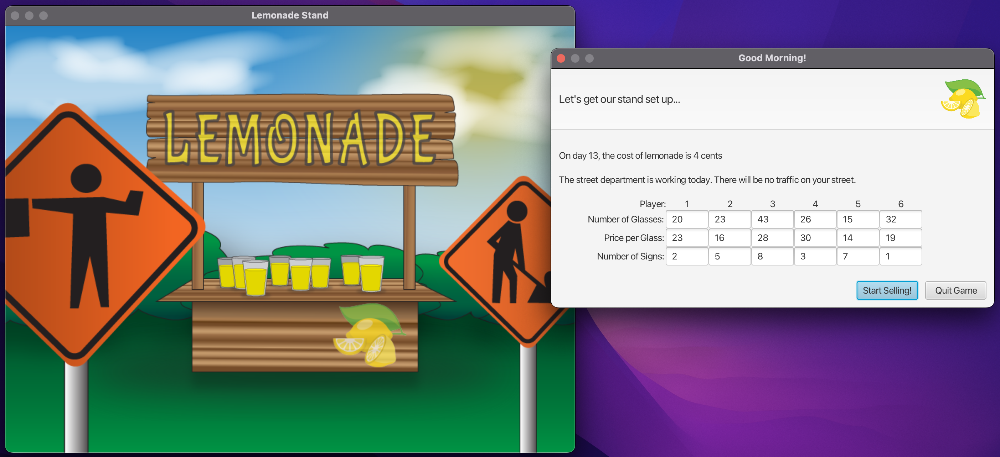

# Lemonade Stand
A simple education game where you and some friends sell lemonade each day.

## About
Based on "Lemonade Stand" for Apple II (c 1979) originally written in BASIC.
Ported from original BASIC code into Java/JavaFX.  The essential game behaviour
is the same as the original game.  This newer version has enhanced visuals
that update an image of your stand based on the daily environment situations.

